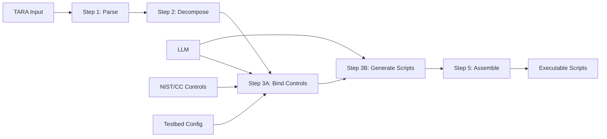

# 🚗 TARA Pipeline: Automotive Security Test Generator

[](https://www.python.org/downloads/)
[](LICENSE)
[](CONTRIBUTING.md)
[](https://www.anthropic.com/claude)

> **Transform TARA attack trees into executable automotive security test scripts with AI-powered code generation**


## ✨ Features

🎯 **TARA to Code**: Convert ISO/SAE 21434 attack trees into runnable Python scripts  
🤖 **AI-Powered**: LLM-enhanced script generation with Claude Sonnet  
🔒 **Security Controls**: NIST SP 800-53 & Common Criteria SFR integration  
🚗 **Automotive Protocols**: DoIP, CAN, SOME/IP, D-Bus support  
📊 **Real-time Research**: Dynamic library discovery and endpoint resolution  
🔄 **Timestamped Runs**: Preserve all execution results automatically  
⚡ **No-LLM Mode**: Works without API keys using intelligent stubs

## 🚀 Quick Start

### Prerequisites
- Python 3.8+
- *(Optional)* Anthropic API key for enhanced LLM features

### 1. Installation
```bash
git clone https://github.com/yourusername/tara-pipeline.git
cd tara-pipeline
pip install -r requirements.txt  # Optional dependencies
```

### 2. Basic Usage
```bash
# Test the setup
python test_setup.py

# Run without LLM (stub mode) 
python example_run.py

# Run with LLM features
export ANTHROPIC_API_KEY="your-api-key"
python pipeline_runner.py inputs/threats.json inputs/system_model.json output/
```

### 3. Target Specific Scenarios
```bash
# Generate scripts for specific attack scenarios
python pipeline_runner.py inputs/threats.json inputs/system_model.json output/ \
  --scenarios TS_07_DIAGNOSTIC_BYPASS_AND_ECU_RESET

# Multiple scenarios
python pipeline_runner.py inputs/threats.json inputs/system_model.json output/ \
  --scenarios TS_04_SAFETY_CRITICAL_CAN_INJECTION TS_05_COMFORT_BUS_INJECTION
```

## 📋 Available Attack Scenarios

| Scenario ID | Description | Protocols |
|-------------|-------------|-----------|
| `TS_01_REMOTE_IVI_FOOTHOLD` | Remote IVI system compromise | D-Bus TCP |
| `TS_02_UNAUTHORISED_IVI_FUNCTION_ABUSE` | IVI function manipulation | D-Bus TCP |
| `TS_03_SAFETY_BUS_TRAFFIC_INTERCEPTION` | Safety bus traffic capture | CAN |
| `TS_04_SAFETY_CRITICAL_CAN_INJECTION` | Safety system CAN attacks | CAN |
| `TS_05_COMFORT_BUS_INJECTION` | Comfort system attacks | CAN |
| `TS_06_OTA_INTEGRITY_OR_TRANSPORT_BYPASS` | OTA security bypass | SOME/IP |
| `TS_07_DIAGNOSTIC_BYPASS_AND_ECU_RESET` | Diagnostic system compromise | DoIP |
| `TS_08_SOA_UNAUTHENTICATED_INVOCATION` | SOA service exploitation | SOME/IP |

## 🏗️ Pipeline Architecture



### Core Components
- **Step 1**: Parse and normalize TARA input files
- **Step 2**: Decompose attack trees into execution plans  
- **Step 3A**: Bind security controls to attack steps (with LLM)
- **Step 3B**: Generate executable Python scripts (with LLM)
- **Step 5**: Assemble final test harness

## 📊 Example Output

### Generated Script Structure
```
output/
└── run_20240426_143052/           # Timestamped execution
    ├── steps/                     # Individual attack steps
    │   └── TS_07_DIAGNOSTIC_BYPASS_AND_ECU_RESET/
    │       └── P_TS_07_DOIP_BYPASS_RESET/
    │           ├── T1.py          # DoIP connection & routing
    │           ├── T2.py          # Vehicle ID request
    │           ├── T3.py          # Diagnostic session setup
    │           └── T4.py          # ECU reset command
    ├── assembled/                 # Complete test script
    │   └── TS_07_..._RESET.py    # 28KB executable script
    └── cache/                     # LLM response cache
```

### Sample Generated Code
```python
# T1.py - DoIP Connection & Routing Activation
import time
import socket
from doipclient import DoIPClient

def run_step(context: dict, artifacts: dict) -> dict:
    # Read endpoint configuration
    endpoint = {
        "host": "172.23.96.1",
        "port": 8445,
        "protocol": "doip_tcp",
        "doip_version": "0x02",
        "doip_entity_address": "0x00E0"
    }
    
    # Establish DoIP connection with routing activation
    client = DoIPClient(
        ecu_ip_address=endpoint["host"],
        ecu_logical_address=int(endpoint["doip_entity_address"], 16),
        tcp_port=endpoint["port"]
    )
    
    # Return structured observations
    return {
        "observations": [{"name": "doip_connection", "value": True}],
        "artifacts": {"client": client},
        "notes": "DoIP routing activation successful"
    }
```

## ⚙️ Configuration

### API Key Setup
```bash
# Temporary (current session)
export ANTHROPIC_API_KEY="sk-ant-your-key-here"

# Permanent (Linux/Mac)
echo 'export ANTHROPIC_API_KEY="sk-ant-your-key-here"' >> ~/.bashrc

# Windows
setx ANTHROPIC_API_KEY "sk-ant-your-key-here"
```

### Command Line Options
```bash
python pipeline_runner.py [threats] [system_model] [output] [options]

Options:
  --scenarios SCENARIO [SCENARIO ...]   Target specific scenarios
  --api-key API_KEY                     Anthropic API key
  --no-llm                              Disable LLM (use stubs)
  --run-name NAME                       Custom output folder name  
  --no-timestamp                        Disable timestamped folders
  --help                                Show help message
```

## 🔒 Security & Ethics

### ⚠️ Important Usage Guidelines

- ✅ **Authorized Testing Only**: Use only on systems you own or have explicit permission to test
- ✅ **Research & Defense**: Educational research and defensive security testing
- ✅ **Compliance**: Ensure compliance with local laws and regulations
- ❌ **No Malicious Use**: Never use for unauthorized access or malicious purposes

### Data Privacy
- API keys are used only for LLM script generation
- No vehicle data or test results are transmitted to external services
- All generated scripts run locally in your environment

## 📈 Performance & Costs

### Execution Metrics
- **Setup Time**: < 1 minute
- **Script Generation**: 2-5 minutes per scenario (with LLM)
- **Stub Mode**: < 30 seconds per scenario
- **Memory Usage**: < 500MB typical

### LLM Costs (Approximate)
- **Single Scenario**: $0.01-0.05
- **Complete Test Suite (8 scenarios)**: $0.10-0.40
- **Stub Mode**: $0.00 (free)

## 🛠️ Development

### Project Structure
```
├── pipeline_runner.py          # Main orchestrator
├── step1_prepare_inputs.py     # Input parsing
├── step2_decompose_attack.py   # Attack decomposition  
├── step3a_bind_controls.py     # Control binding
├── step3b_generate_scripts.py  # Script generation
├── step5_assemble_v3.py        # Final assembly
├── pipeline_types.py           # Type definitions
├── contract_verifier.py        # Code safety validation
├── safety_validator.py         # Security validation
├── library_researcher.py       # Real-time library research
└── inputs/                     # Sample TARA files
    ├── threats.json           # Attack tree definitions
    └── system_model.json      # Testbed configuration
```

### Adding New Scenarios
1. Define attack tree in `threats.json`
2. Configure endpoints in `system_model.json`  
3. Run pipeline to generate scripts
4. Validate generated code

### Contributing
1. Fork the repository
2. Create a feature branch: `git checkout -b feature/amazing-feature`
3. Make your changes and test thoroughly
4. Commit: `git commit -m 'Add amazing feature'`
5. Push: `git push origin feature/amazing-feature`
6. Open a Pull Request

## 🔧 Troubleshooting

### Common Issues

**Import Errors**
```bash
ModuleNotFoundError: No module named 'pipeline_types'
# Solution: Ensure you're in the project directory
cd tara-pipeline
python pipeline_runner.py ...
```

**API Key Errors**  
```bash
Error: No API key provided
# Solution: Set environment variable or use --no-llm
export ANTHROPIC_API_KEY="your-key"
# OR
python pipeline_runner.py ... --no-llm
```

**Permission Errors**
```bash
PermissionError: [Errno 13] Permission denied: 'output'  
# Solution: Check output directory permissions
chmod 755 output/
# OR use different output directory
python pipeline_runner.py ... different_output/
```

### Getting Help
- 🐛 **Bug Reports**: [GitHub Issues](https://github.com/yourusername/tara-pipeline/issues)
- 💬 **Questions**: [GitHub Discussions](https://github.com/yourusername/tara-pipeline/discussions)
- 📧 **Security Issues**: security@yourorganization.com

## 📚 References

- [ISO/SAE 21434](https://www.iso.org/standard/70918.html) - Cybersecurity Engineering
- [NIST SP 800-53](https://csrc.nist.gov/publications/detail/sp/800-53/rev-5/final) - Security Controls
- [Miller & Valasek Research](http://illmatics.com/Remote%20Car%20Hacking.pdf) - Original Cherokee Research
- [Anthropic Claude](https://www.anthropic.com/claude) - LLM Provider

## 🏆 Acknowledgments

- **Miller & Valasek**: Original automotive security research
- **Anthropic**: Claude LLM for intelligent code generation
- **Open Source Community**: Libraries and tools that make this possible

## 📄 License

This project is licensed under the MIT License - see the [LICENSE](LICENSE) file for details.

---

<div align="center">
<b>⭐ Star this repository if you find it useful!</b><br>
<b>🐛 Report bugs and 💡 suggest features via GitHub Issues</b><br>
<b>🤝 Contributions are welcome - see CONTRIBUTING.md</b>
</div>

---

**Made with 🚗 for automotive security research**