# Jeep Cherokee 기반 19개 시나리오 정리본 (한국어 표 + Mermaid 소스)
이 문서는 최신 19개 시나리오 세트를 기준으로, 각 `TS`별로 한국어 자연어 단계(`T1`, `T2`, ...)와 교수님 검토용 Mermaid 공격 트리 소스를 정리한 것이다.
## 전체 요약
| 구분 | 개수 |
|---|---:|
| 전체 시나리오 | 19 |
| 직접 반영(direct) | 8 |
| 대체 메커니즘으로 재현(surrogate) | 9 |
| 확장 시나리오(extension) | 2 |

## 사용 규칙
- 아래 표의 `T` 단계 문장은 모두 **교수님께 보여주기 위한 자연어 문장**으로 다시 다듬은 것이다.
- 아래 Mermaid 코드는 **바로 붙여넣어 렌더링할 수 있는 소스**다.
- 모든 공격 트리는 현재 최신 19개 시나리오 파일의 `attack_tree` 구조를 그대로 따라, **루트 목표 + AND 게이트 + T 단계 leaf** 형태로 정리했다.

## 1. 원격 노출 및 제어 세션 계열

### TS_J02. 원격 공격자는 IVI 제어 서비스가 외부 네트워크에서 도달 가능한지 확인한다
| 항목 | 내용 |
|---|---|
| 시나리오 목표 | 원격 공격자는 IVI 제어 서비스가 외부 네트워크에서 도달 가능한지 확인한다 |
| 진입점 | 외부에서 도달 가능한 IVI 네트워크 인터페이스 |
| 종점 | IVI D-Bus TCP 리스너 포트 |
| 전제조건 | IVI 네트워크 인터페이스가 외부 네트워크에 노출되어 있다. |
| 백서 대응 섹션 | Open ports / Cellular Access |
| 에뮬레이터 실행 | implemented |
| 백서 충실도 | 직접 반영 |

#### 단계별 자연어 정리

| 단계 ID | 자연어 단계 문장 |
|---|---|
| T1 | 공격자는 대상이 되는 IVI의 IP 주소를 식별한다. |
| T2 | 공격자는 IVI 제어 포트로 TCP 연결을 시도한다. |
| T3 | 공격자는 연결이 수락되는지 또는 거부되는지를 확인한다. |

#### Mermaid 소스

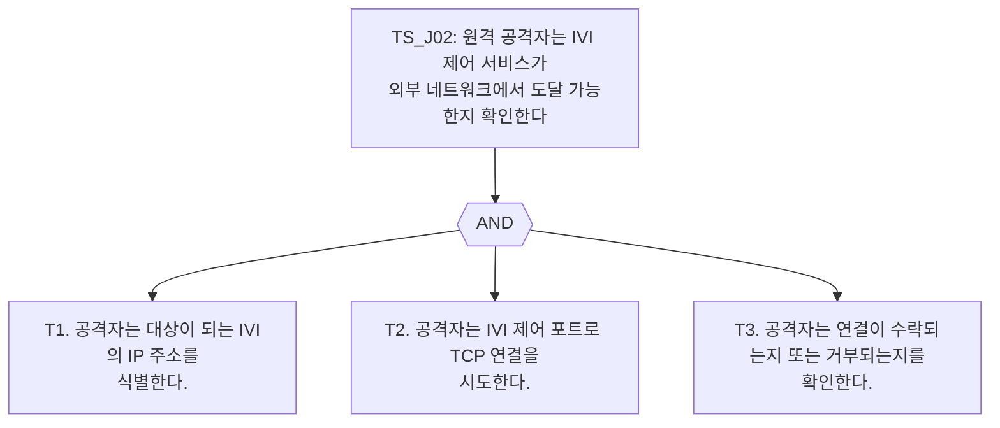

### TS_J03. 원격 공격자는 인증 없이 IVI 제어 세션을 수립한다
| 항목 | 내용 |
|---|---|
| 시나리오 목표 | 원격 공격자는 인증 없이 IVI 제어 세션을 수립한다 |
| 진입점 | 외부에 노출된 IVI 원격 제어 진입점 |
| 종점 | 인증되지 않은 IVI 제어 세션 |
| 전제조건 | 외부에서 도달 가능한 IVI 원격 제어 진입점이 존재한다. |
| 백서 대응 섹션 | D-Bus Services / Cellular Access |
| 에뮬레이터 실행 | implemented |
| 백서 충실도 | 직접 반영 |

#### 단계별 자연어 정리

| 단계 ID | 자연어 단계 문장 |
|---|---|
| T1 | 공격자는 외부에 노출된 IVI 제어 진입점에 접속한다. |
| T2 | 공격자는 원격 제어 세션 협상을 시작한다. |
| T3 | 공격자는 인증되지 않은 세션 수립이 허용되는지 확인한다. |
| T4 | 공격자는 제어 메시지를 주고받을 수 있는 세션 상태에 도달한다. |

#### Mermaid 소스

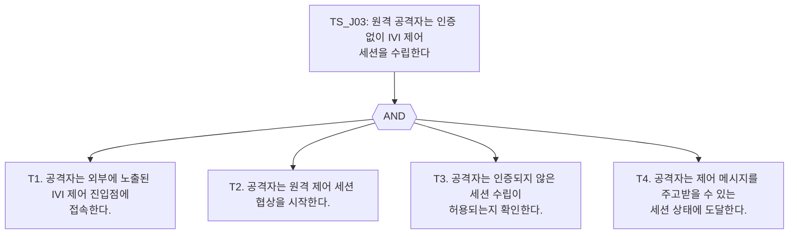

### TS_J04. 원격 공격자는 외부에 노출된 IVI 서비스 표면을 열거한다
| 항목 | 내용 |
|---|---|
| 시나리오 목표 | 원격 공격자는 외부에 노출된 IVI 서비스 표면을 열거한다 |
| 진입점 | 인증되지 않은 IVI 제어 세션 |
| 종점 | 노출된 서비스·인터페이스·기능 목록 |
| 전제조건 | 공격자는 이미 인증되지 않은 IVI 제어 세션을 확보했다. |
| 백서 대응 섹션 | D-Bus Services / DFeet enumeration |
| 에뮬레이터 실행 | implemented |
| 백서 충실도 | 직접 반영 |

#### 단계별 자연어 정리

| 단계 ID | 자연어 단계 문장 |
|---|---|
| T1 | 공격자는 외부에 노출된 서비스 목록을 수집한다. |
| T2 | 공격자는 호출 가능한 인터페이스를 식별한다. |
| T3 | 공격자는 조회용 기능과 상태 변경용 기능을 구분한다. |

#### Mermaid 소스

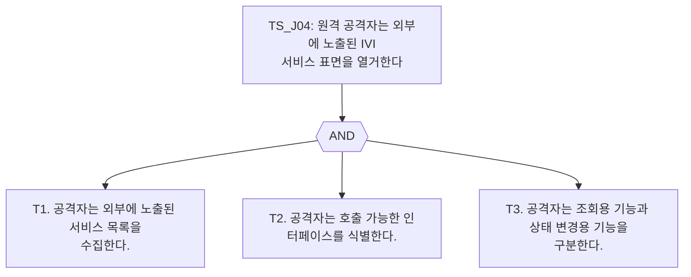

## 2. IVI 기능 악용 계열

### TS_J05. 원격 공격자는 차량 위치 정보와 식별 정보를 획득한다
| 항목 | 내용 |
|---|---|
| 시나리오 목표 | 원격 공격자는 차량 위치 정보와 식별 정보를 획득한다 |
| 진입점 | 인증되지 않은 IVI 제어 세션 |
| 종점 | 위치 조회 기능 |
| 전제조건 | 공격자는 이미 인증되지 않은 IVI 제어 세션을 확보했다. |
| 백서 대응 섹션 | Uconnect attack payloads – GPS |
| 에뮬레이터 실행 | implemented |
| 백서 충실도 | 직접 반영 |

#### 단계별 자연어 정리

| 단계 ID | 자연어 단계 문장 |
|---|---|
| T1 | 공격자는 위치 조회 기능을 식별한다. |
| T2 | 공격자는 인증 없이 위치 조회 기능을 호출한다. |
| T3 | 공격자는 반환된 차량 위치 정보와 식별 정보를 수집한다. |

#### Mermaid 소스

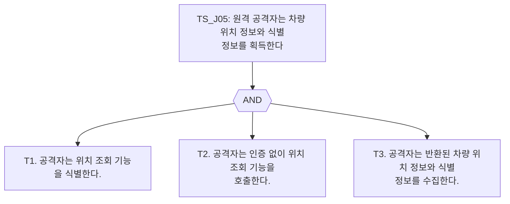

### TS_J06. 원격 공격자는 공조 기능을 무단으로 제어한다
| 항목 | 내용 |
|---|---|
| 시나리오 목표 | 원격 공격자는 공조 기능을 무단으로 제어한다 |
| 진입점 | 인증되지 않은 IVI 제어 세션 |
| 종점 | 공조 제어 기능 |
| 전제조건 | 공격자는 이미 인증되지 않은 IVI 제어 세션을 확보했다. |
| 백서 대응 섹션 | Uconnect attack payloads – HVAC |
| 에뮬레이터 실행 | implemented |
| 백서 충실도 | 직접 반영 |

#### 단계별 자연어 정리

| 단계 ID | 자연어 단계 문장 |
|---|---|
| T1 | 공격자는 공조 제어 기능을 식별한다. |
| T2 | 공격자는 원하는 실내 환경 설정 값을 전달한다. |
| T3 | 공격자는 공조 상태가 실제로 변경되었는지 확인한다. |

#### Mermaid 소스

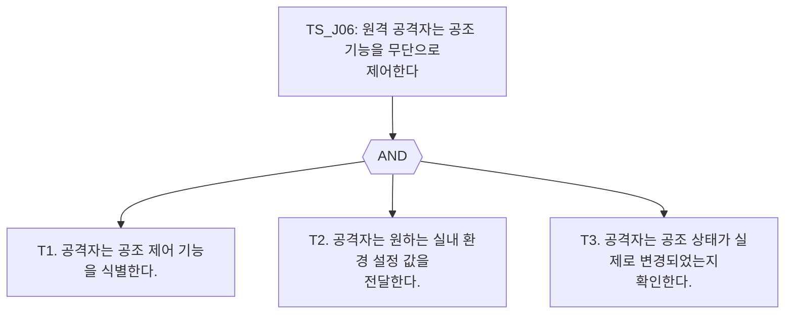

### TS_J07. 원격 공격자는 라디오 볼륨을 무단으로 변경한다
| 항목 | 내용 |
|---|---|
| 시나리오 목표 | 원격 공격자는 라디오 볼륨을 무단으로 변경한다 |
| 진입점 | 인증되지 않은 IVI 제어 세션 |
| 종점 | 오디오 출력 제어 기능 |
| 전제조건 | 공격자는 이미 인증되지 않은 IVI 제어 세션을 확보했다. |
| 백서 대응 섹션 | Uconnect attack payloads – Radio Volume |
| 에뮬레이터 실행 | implemented |
| 백서 충실도 | 직접 반영 |

#### 단계별 자연어 정리

| 단계 ID | 자연어 단계 문장 |
|---|---|
| T1 | 공격자는 오디오 출력 제어 기능을 식별한다. |
| T2 | 공격자는 목표 볼륨으로 상태를 바꾸는 요청을 전송한다. |
| T3 | 공격자는 볼륨 상태가 실제로 변경되었는지 확인한다. |

#### Mermaid 소스

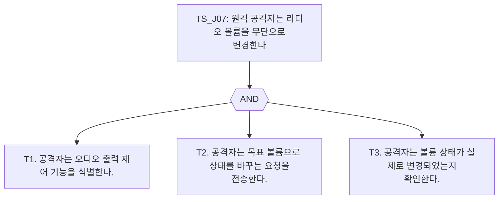

### TS_J09. 원격 공격자는 라디오 채널을 무단으로 변경한다
| 항목 | 내용 |
|---|---|
| 시나리오 목표 | 원격 공격자는 라디오 채널을 무단으로 변경한다 |
| 진입점 | 인증되지 않은 IVI 제어 세션 |
| 종점 | 라디오 튜너 기능 |
| 전제조건 | 공격자는 이미 인증되지 않은 IVI 제어 세션을 확보했다. |
| 백서 대응 섹션 | Uconnect attack payloads – Radio Station |
| 에뮬레이터 실행 | implemented |
| 백서 충실도 | 직접 반영 |

#### 단계별 자연어 정리

| 단계 ID | 자연어 단계 문장 |
|---|---|
| T1 | 공격자는 라디오 튜너 기능을 식별한다. |
| T2 | 공격자는 목표 주파수 또는 채널로 변경 요청을 전송한다. |
| T3 | 공격자는 방송 채널 상태가 실제로 변경되었는지 확인한다. |

#### Mermaid 소스

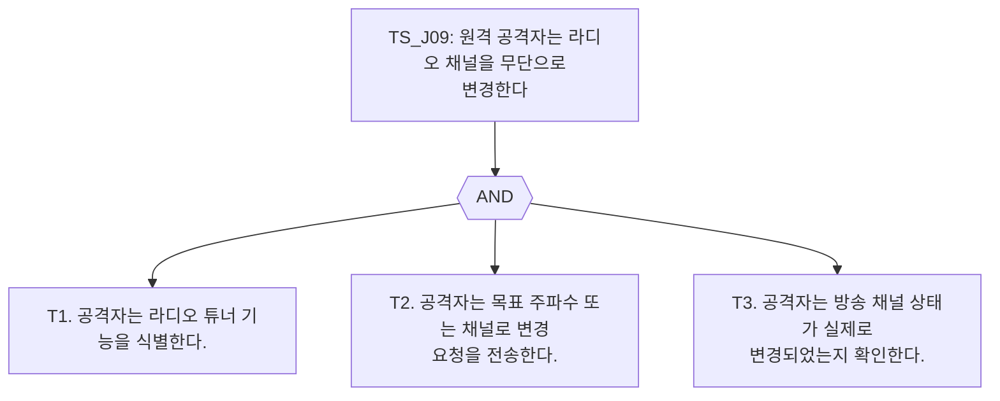

### TS_J10. 원격 공격자는 디스플레이 출력 상태를 무단으로 변경한다
| 항목 | 내용 |
|---|---|
| 시나리오 목표 | 원격 공격자는 디스플레이 출력 상태를 무단으로 변경한다 |
| 진입점 | 인증되지 않은 IVI 제어 세션 |
| 종점 | 디스플레이 출력 제어 기능 |
| 전제조건 | 공격자는 이미 인증되지 않은 IVI 제어 세션을 확보했다. |
| 백서 대응 섹션 | Uconnect attack payloads – Display |
| 에뮬레이터 실행 | implemented |
| 백서 충실도 | 직접 반영 |

#### 단계별 자연어 정리

| 단계 ID | 자연어 단계 문장 |
|---|---|
| T1 | 공격자는 디스플레이 출력 제어 기능을 식별한다. |
| T2 | 공격자는 화면 상태를 바꾸는 제어 기능을 호출한다. |
| T3 | 공격자는 화면 상태 변화가 실제로 발생하는지 확인한다. |

#### Mermaid 소스

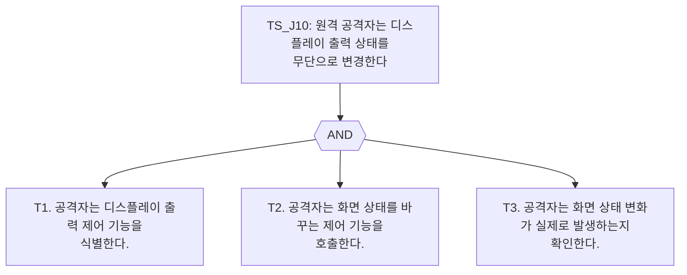

## 3. 차량 버스 관찰 및 메시지 주입 계열

### TS_J11. 공격자는 IVI에서 도달 가능한 CAN 브리지를 통해 차량 버스 트래픽을 수집한다
| 항목 | 내용 |
|---|---|
| 시나리오 목표 | 공격자는 IVI에서 도달 가능한 CAN 브리지를 통해 차량 버스 트래픽을 수집한다 |
| 진입점 | CAN socketcand TCP 브리지 |
| 종점 | 차량 버스 프레임 스트림 |
| 전제조건 | CAN socketcand TCP 브리지에 도달 가능하다. |
| 백서 대응 섹션 | CAN Connectivity / internal bus observation |
| 에뮬레이터 실행 | implemented |
| 백서 충실도 | 대체 메커니즘으로 재현 |

#### 단계별 자연어 정리

| 단계 ID | 자연어 단계 문장 |
|---|---|
| T1 | 공격자는 CAN socketcand TCP 브리지에 접속한다. |
| T2 | 공격자는 CAN 채널을 연다. |
| T3 | 공격자는 rawmode로 진입해 모든 CAN 프레임을 수신한다. |
| T4 | 공격자는 수집된 트래픽에서 안전 관련 ECU의 arbitration ID를 식별한다. |

#### Mermaid 소스

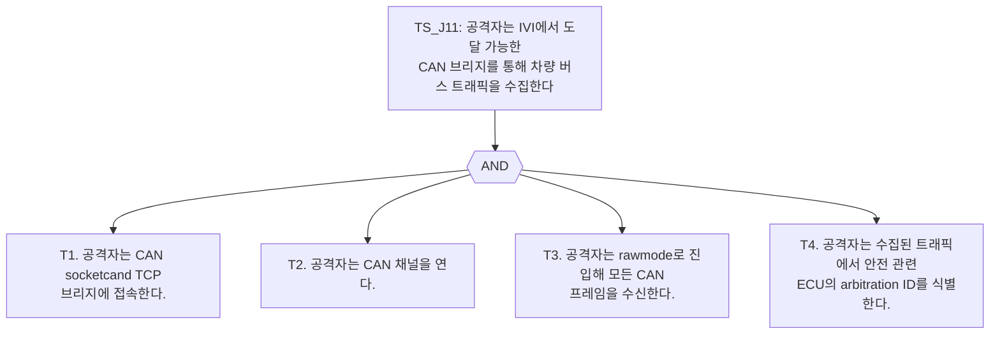

### TS_J12. 공격자는 안전 관련 차량 버스에 위조 제동 제어 메시지를 주입한다
| 항목 | 내용 |
|---|---|
| 시나리오 목표 | 공격자는 안전 관련 차량 버스에 위조 제동 제어 메시지를 주입한다 |
| 진입점 | CAN socketcand TCP 브리지 |
| 종점 | 제동 제어 기능 |
| 전제조건 | 공격자는 CAN socketcand TCP 브리지에 접근할 수 있고, CAN 채널이 이미 열린 상태다. |
| 백서 대응 섹션 | Cyber Physical CAN messages – No brakes |
| 에뮬레이터 실행 | implemented |
| 백서 충실도 | 대체 메커니즘으로 재현 |

#### 단계별 자연어 정리

| 단계 ID | 자연어 단계 문장 |
|---|---|
| T1 | 공격자는 제동 제어 기능과 연관된 버스 메시지 패턴을 식별한다. |
| T2 | 공격자는 위조된 제동 제어 메시지를 구성한다. |
| T3 | 공격자는 CAN 브리지를 통해 위조 메시지를 주입한다. |
| T4 | 공격자는 제동 제어 기능이 주입된 메시지를 수용했는지 확인한다. |

#### Mermaid 소스

### TS_J13. 공격자는 안전 관련 차량 버스에 위조 조향 제어 메시지를 주입한다
| 항목 | 내용 |
|---|---|
| 시나리오 목표 | 공격자는 안전 관련 차량 버스에 위조 조향 제어 메시지를 주입한다 |
| 진입점 | CAN socketcand TCP 브리지 |
| 종점 | 조향 제어 기능 |
| 전제조건 | 공격자는 CAN socketcand TCP 브리지에 접근할 수 있고, CAN 채널이 이미 열린 상태다. |
| 백서 대응 섹션 | Cyber Physical CAN messages – Steering |
| 에뮬레이터 실행 | implemented |
| 백서 충실도 | 대체 메커니즘으로 재현 |

#### 단계별 자연어 정리

| 단계 ID | 자연어 단계 문장 |
|---|---|
| T1 | 공격자는 조향 제어 기능과 연관된 버스 메시지 패턴을 식별한다. |
| T2 | 공격자는 위조된 조향 제어 메시지를 구성한다. |
| T3 | 공격자는 CAN 브리지를 통해 위조 메시지를 주입한다. |
| T4 | 공격자는 조향 제어 기능이 주입된 메시지를 수용했는지 확인한다. |

#### Mermaid 소스

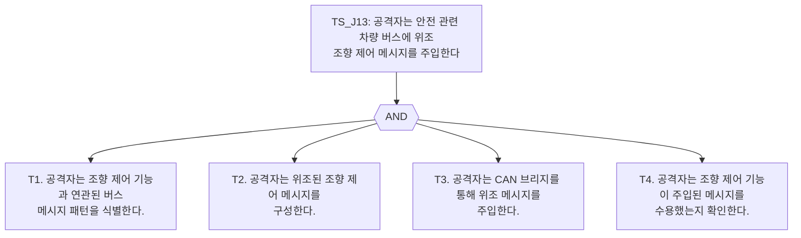

### TS_J14. 공격자는 위조된 파워트레인 제어 메시지를 주입해 엔진을 정지시킨다
| 항목 | 내용 |
|---|---|
| 시나리오 목표 | 공격자는 위조된 파워트레인 제어 메시지를 주입해 엔진을 정지시킨다 |
| 진입점 | CAN socketcand TCP 브리지 |
| 종점 | 엔진 제어 기능 |
| 전제조건 | 공격자는 CAN socketcand TCP 브리지에 접근할 수 있고, CAN 채널이 이미 열린 상태다. |
| 백서 대응 섹션 | Cyber Physical CAN messages – Kill engine |
| 에뮬레이터 실행 | implemented |
| 백서 충실도 | 대체 메커니즘으로 재현 |

#### 단계별 자연어 정리

| 단계 ID | 자연어 단계 문장 |
|---|---|
| T1 | 공격자는 엔진 제어 기능과 연관된 버스 메시지 패턴을 식별한다. |
| T2 | 공격자는 위조된 파워트레인 제어 메시지를 구성한다. |
| T3 | 공격자는 CAN 브리지를 통해 위조 메시지를 주입한다. |
| T4 | 공격자는 엔진 제어 기능이 주입된 메시지를 수용했는지 확인한다. |

#### Mermaid 소스

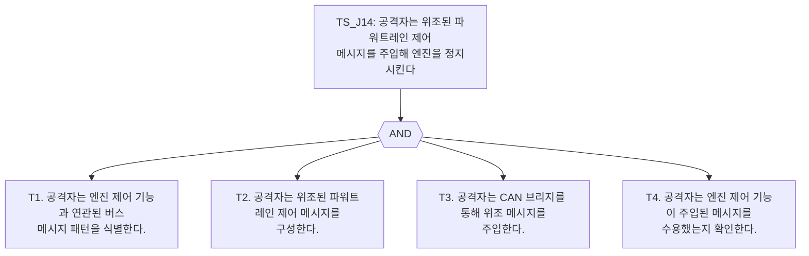

### TS_J15. 공격자는 위조된 변속 제어 메시지를 주입해 변속기를 무력화한다
| 항목 | 내용 |
|---|---|
| 시나리오 목표 | 공격자는 위조된 변속 제어 메시지를 주입해 변속기를 무력화한다 |
| 진입점 | CAN socketcand TCP 브리지 |
| 종점 | 변속 제어 기능 |
| 전제조건 | 공격자는 CAN socketcand TCP 브리지에 접근할 수 있고, CAN 채널이 이미 열린 상태다. |
| 백서 대응 섹션 | Cyber Physical CAN messages – Transmission disruption |
| 에뮬레이터 실행 | implemented |
| 백서 충실도 | 대체 메커니즘으로 재현 |

#### 단계별 자연어 정리

| 단계 ID | 자연어 단계 문장 |
|---|---|
| T1 | 공격자는 변속 제어 기능과 연관된 버스 메시지 패턴을 식별한다. |
| T2 | 공격자는 위조된 변속 제어 메시지를 구성한다. |
| T3 | 공격자는 CAN 브리지를 통해 위조 메시지를 주입한다. |
| T4 | 공격자는 변속 제어 기능이 주입된 메시지를 수용했는지 확인한다. |

#### Mermaid 소스

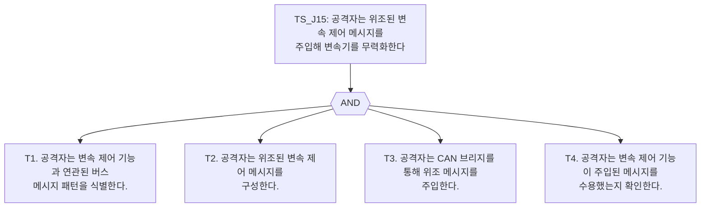

### TS_J16. 공격자는 위조된 컴포트 버스 메시지를 주입해 공조 설정을 변경한다
| 항목 | 내용 |
|---|---|
| 시나리오 목표 | 공격자는 위조된 컴포트 버스 메시지를 주입해 공조 설정을 변경한다 |
| 진입점 | CAN socketcand TCP 브리지 |
| 종점 | 컴포트 버스 공조 제어 기능 |
| 전제조건 | 공격자는 CAN socketcand TCP 브리지에 접근할 수 있고, CAN 채널이 이미 열린 상태다. |
| 백서 대응 섹션 | CAN Connectivity / Normal CAN messages |
| 에뮬레이터 실행 | implemented |
| 백서 충실도 | 대체 메커니즘으로 재현 |

#### 단계별 자연어 정리

| 단계 ID | 자연어 단계 문장 |
|---|---|
| T1 | 공격자는 공조 설정과 연관된 컴포트 버스 메시지 패턴을 식별한다. |
| T2 | 공격자는 위조된 컴포트 버스 메시지를 구성한다. |
| T3 | 공격자는 CAN 브리지를 통해 위조 메시지를 주입한다. |
| T4 | 공격자는 공조 상태가 실제로 변경되었는지 확인한다. |

#### Mermaid 소스

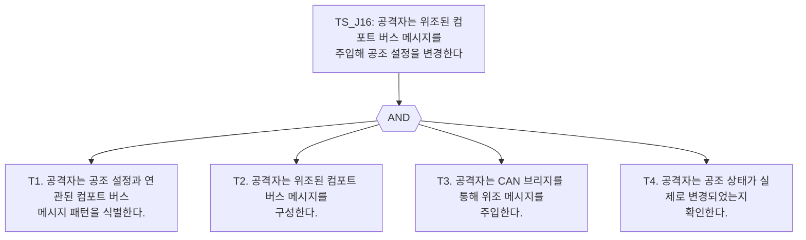

### TS_J17. 공격자는 위조된 컴포트 버스 메시지를 주입해 오디오 앰프 동작을 변경한다
| 항목 | 내용 |
|---|---|
| 시나리오 목표 | 공격자는 위조된 컴포트 버스 메시지를 주입해 오디오 앰프 동작을 변경한다 |
| 진입점 | CAN socketcand TCP 브리지 |
| 종점 | 컴포트 버스 오디오 앰프 기능 |
| 전제조건 | 공격자는 CAN socketcand TCP 브리지에 접근할 수 있고, CAN 채널이 이미 열린 상태다. |
| 백서 대응 섹션 | CAN Connectivity / Normal CAN messages |
| 에뮬레이터 실행 | implemented |
| 백서 충실도 | 대체 메커니즘으로 재현 |

#### 단계별 자연어 정리

| 단계 ID | 자연어 단계 문장 |
|---|---|
| T1 | 공격자는 오디오 앰프 동작과 연관된 컴포트 버스 메시지 패턴을 식별한다. |
| T2 | 공격자는 위조된 컴포트 버스 메시지를 구성한다. |
| T3 | 공격자는 CAN 브리지를 통해 위조 메시지를 주입한다. |
| T4 | 공격자는 오디오 앰프 상태가 실제로 변경되었는지 확인한다. |

#### Mermaid 소스

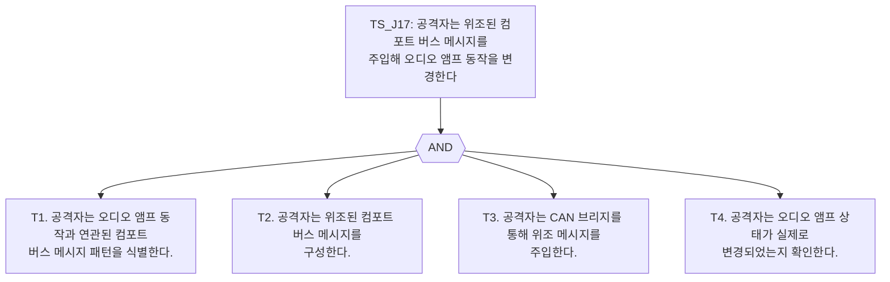

## 4. OTA 펌웨어 변조 계열

### TS_J18. 공격자는 OTA 업데이트 서비스에 서명되지 않은 펌웨어 패키지를 제출한다
| 항목 | 내용 |
|---|---|
| 시나리오 목표 | 공격자는 OTA 업데이트 서비스에 서명되지 않은 펌웨어 패키지를 제출한다 |
| 진입점 | OTA 펌웨어 업데이트 엔드포인트 |
| 종점 | 펌웨어 서명 검증 기능 |
| 전제조건 | OTA 업데이트 엔드포인트에 도달 가능하다. |
| 백서 대응 섹션 | Updating the V850 / Flashing the V850 without USB |
| 에뮬레이터 실행 | implemented |
| 백서 충실도 | 대체 메커니즘으로 재현 |

#### 단계별 자연어 정리

| 단계 ID | 자연어 단계 문장 |
|---|---|
| T1 | 공격자는 OTA 펌웨어 업데이트 엔드포인트를 찾는다. |
| T2 | 공격자는 사용 가능한 펌웨어 업데이트가 있는지 확인한다. |
| T3 | 공격자는 유효한 서명이 없는 펌웨어 패키지를 제출한다. |
| T4 | 공격자는 서명되지 않은 패키지가 수용되었는지 확인한다. |

#### Mermaid 소스

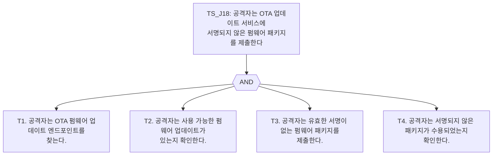

### TS_J19. 공격자는 보호되지 않은 채널을 통해 OTA 펌웨어 서비스를 이용한다
| 항목 | 내용 |
|---|---|
| 시나리오 목표 | 공격자는 보호되지 않은 채널을 통해 OTA 펌웨어 서비스를 이용한다 |
| 진입점 | OTA 평문 HTTP 엔드포인트 |
| 종점 | TLS 없이 노출된 펌웨어 업데이트 서비스 |
| 전제조건 | OTA 서비스가 TLS 강제를 끈 상태로 동작 중이다. |
| 백서 대응 섹션 | Network Settings / OTA transport configuration |
| 에뮬레이터 실행 | implemented |
| 백서 충실도 | 대체 메커니즘으로 재현 |

#### 단계별 자연어 정리

| 단계 ID | 자연어 단계 문장 |
|---|---|
| T1 | 공격자는 평문 HTTP로 OTA 엔드포인트에 연결을 시도한다. |
| T2 | 공격자는 TLS 없이도 연결이 성공하는지 확인한다. |
| T3 | 공격자는 암호화되지 않은 채널에서도 펌웨어 관련 동작이 가능한지 확인한다. |

#### Mermaid 소스

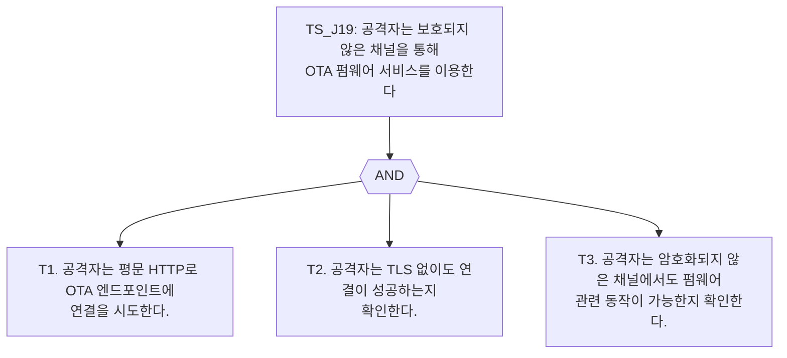

## 5. 원격 진단 프로토콜 악용 계열

### TS_J20. 공격자는 원격 진단 게이트웨이에서 진단 접근 통제를 우회하고 ECU 리셋을 유발한다
| 항목 | 내용 |
|---|---|
| 시나리오 목표 | 공격자는 원격 진단 게이트웨이에서 진단 접근 통제를 우회하고 ECU 리셋을 유발한다 |
| 진입점 | 원격 진단 게이트웨이 |
| 종점 | 진단 접근 통제 및 ECU 리셋 기능 |
| 전제조건 | DoIP TCP 게이트웨이에 도달 가능하다. |
| 백서 대응 섹션 | Extension scenario – emulator-supported diagnostic protocol abuse |
| 에뮬레이터 실행 | implemented |
| 백서 충실도 | 확장 시나리오 |

#### 단계별 자연어 정리

| 단계 ID | 자연어 단계 문장 |
|---|---|
| T1 | 공격자는 원격 진단 게이트웨이에 접속한다. |
| T2 | 공격자는 의도된 인증 절차를 거치지 않은 상태에서 진단 세션 전환을 요청한다. |
| T3 | 공격자는 진단 접근 통제 메커니즘이 우회 가능한지 탐색한다. |
| T4 | 공격자는 진단 서비스를 통해 ECU 리셋 동작을 시도한다. |
| T5 | 공격자는 ECU 리셋이 실제로 수행되었는지 확인한다. |

#### Mermaid 소스

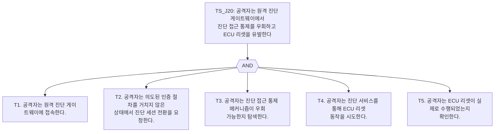

## 6. 서비스 지향 통신 악용 계열

### TS_J21. 공격자는 인증 없이 서비스 지향 차량 기능을 호출한다
| 항목 | 내용 |
|---|---|
| 시나리오 목표 | 공격자는 인증 없이 서비스 지향 차량 기능을 호출한다 |
| 진입점 | SOME/IP 서비스 엔드포인트 |
| 종점 | VehicleStatusService 기능들 |
| 전제조건 | SOME/IP TCP 서비스 엔드포인트에 도달 가능하다. |
| 백서 대응 섹션 | Extension scenario – emulator-supported service-oriented communication abuse |
| 에뮬레이터 실행 | implemented |
| 백서 충실도 | 확장 시나리오 |

#### 단계별 자연어 정리

| 단계 ID | 자연어 단계 문장 |
|---|---|
| T1 | 공격자는 서비스 지향 차량 기능 엔드포인트에 접속한다. |
| T2 | 공격자는 인증 없이 조회 가능한 차량 기능을 호출한다. |
| T3 | 공격자는 민감한 데이터가 반환되는지 또는 접근이 거부되는지 확인한다. |
| T4 | 공격자는 인증 없이 상태를 바꾸는 차량 기능을 호출한다. |
| T5 | 공격자는 차량 상태가 실제로 변경되었는지 확인한다. |

#### Mermaid 소스

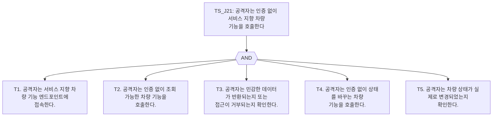
